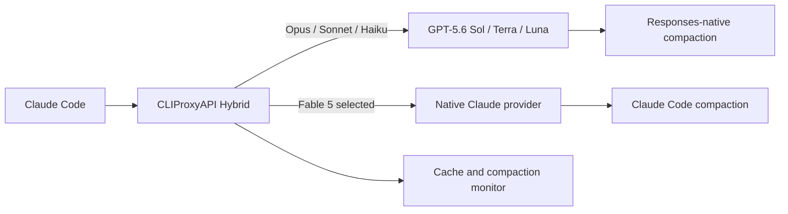

# CLIProxyAPI Hybrid

[](https://github.com/manan-ramnani/CLIProxyAPI/actions/workflows/ci.yml)
[](https://github.com/manan-ramnani/CLIProxyAPI/releases)
[](LICENSE)

Use **Fable 5 and GPT-5.6 models seamlessly in the same Claude Code workflow**.

Keep Fable as the main model for frontend or product work, delegate backend and adversarial-review tasks to Opus workers backed by GPT-5.6 Sol, and let both lanes review each other without changing terminals or maintaining separate Claude Code installations. One `/model` picker controls the experience; CLIProxyAPI routes each request to the correct provider and applies the correct compaction strategy automatically.

This is an upstream-compatible fork of [router-for-me/CLIProxyAPI](https://github.com/router-for-me/CLIProxyAPI). It adds a hybrid Claude Code route, Codex-native context compaction, cache-aware observability, bounded request logging, and a cross-platform `claude-codex` installer. The original provider support and API compatibility remain intact.

> This project is not affiliated with or endorsed by Anthropic or OpenAI. Review the applicable product terms before using subscription-backed authentication through third-party clients.

## Why this fork exists

Claude Code can use an Anthropic-compatible gateway, but long Codex conversations need different context and cache behavior from native Claude conversations:

- Claude Code normally decides when to compact from the context window advertised by `/v1/models`.
- Codex models can perform native server-side compaction through the Responses API.
- Replacing arbitrary history or compacting too often destroys prompt-prefix continuity and causes expensive cache misses.
- A single Claude Code session may switch between Codex-backed Opus/Sonnet/Haiku classes and a native model such as Fable.

This fork keeps those lanes separate.

### The hybrid experience

Start one `claude-codex` session and use Claude Code normally:

- Select **Fable 5** in `/model` for the main thread. Requests stay on the native Claude provider and use Claude Code's normal compaction.
- Select **Opus**, or launch a workflow that requests an Opus worker. That request routes to **GPT-5.6 Sol at xhigh effort** and uses Codex-native server compaction.
- Sonnet and Haiku workers route to **GPT-5.6 Terra** and **GPT-5.6 Luna**.
- Switch back to Fable at any time. Provider routing, cache identity, context metadata, and compaction state follow the selected model rather than leaking across lanes.

This makes mixed-agent workflows practical: Fable can own frontend implementation while GPT-5.6 Sol owns backend work and adversarial review, with each model reviewing the other's output inside the same Claude Code project.


```mermaid
flowchart LR
    CC["Claude Code"] --> GW["CLIProxyAPI Hybrid"]
    GW -->|"Opus / Sonnet / Haiku"| CX["GPT-5.6 Sol / Terra / Luna"]
    GW -->|"Fable 5 selected"| CL["Native Claude provider"]
    CX --> NC["Responses-native compaction"]
    CL --> AC["Claude Code compaction"]
    GW --> OBS["Cache and compaction monitor"]
```

## Highlights

- Dual-provider `/model` picker: Codex-backed model classes and native Claude models coexist.
- Codex-native compaction at a configurable logical token threshold.
- Bounded multi-pass recovery when a fresh or reset lane already exceeds one upstream context window.
- Exact recent-tail preservation so active tool-call pairs are not split.
- Cache-stable history replacement after compaction.
- Worker-aware state isolation for concurrent Claude Code agents.
- Effort forwarding, including Claude Code's `/effort` and `--effort` controls.
- Fixed-header TUI request monitor with tokens, cache reuse, estimated cost, misses, and compactions.
- Metadata-only success summaries with rolling retention; full request logs only for failures.
- Idempotent PowerShell, Bash, Zsh, and Fish installation for `claude-codex`.
- Clean upstream rebase path and SemVer-compatible hybrid release tags.

## Model routing

The generated `claude-codex` function applies this default class mapping:

| Claude Code class | Routed model | Default reasoning effort |
| --- | --- | --- |
| Opus | `gpt-5.6-sol` | `xhigh` |
| Sonnet | `gpt-5.6-terra` | `xhigh` |
| Haiku | `gpt-5.6-luna` | `xhigh` |
| Native model selected through `/model` | Original Claude model | native behavior |

The launcher starts with `--model opus --effort xhigh` unless either option is already present. All remaining Claude Code arguments are forwarded unchanged. `CLAUDE_CODE_ALWAYS_ENABLE_EFFORT=1` allows Claude Code's effort picker to keep working with gateway model IDs.

The native `claude` command is never replaced or modified by the installer.

## Quick start

### 1. Install Claude Code

Install the current Claude Code CLI from [Anthropic's documentation](https://docs.anthropic.com/en/docs/claude-code/overview), then confirm that the executable is available:

```powershell
claude --version
```

### 2. Get CLIProxyAPI Hybrid

Download an archive from [Releases](https://github.com/manan-ramnani/CLIProxyAPI/releases), or build from source:

```powershell
git clone https://github.com/manan-ramnani/CLIProxyAPI.git
cd CLIProxyAPI
go build -o cli-proxy-api.exe ./cmd/server
```

Go 1.26 or newer is required.

### 3. Create a local configuration

Copy [`config.example.yaml`](config.example.yaml) to `config.yaml`. At minimum, bind locally, choose a strong local client key, and enable native compaction:

```yaml
host: "127.0.0.1"
port: 8317

api-keys:
  - "replace-with-a-random-local-proxy-key"

codex:
  native-compaction:
    enabled: true
    trigger-tokens: 240000
    context-window: 272000
    claude-client-context-window: 1000000
    preserve-recent-tokens: 32000
    retained-message-tokens: 64000
    state-ttl: 168h
```

`claude-client-context-window` is discovery metadata for Codex-backed models, not a claim that the upstream model has a one-million-token context window. It delays Claude Code's client compaction while the proxy enforces the real 272,000-token boundary and begins native compaction at 240,000 logical input tokens.

Do not commit `config.yaml`. It is ignored by this repository.

### 4. Authenticate both providers

Use the fork binary for both OAuth flows:

```powershell
.\cli-proxy-api.exe --config .\config.yaml --codex-login
.\cli-proxy-api.exe --config .\config.yaml --claude-login
```

Claude authentication is optional if you only use Codex models. It is required to select native Claude models such as Fable from the same `/model` picker.

OAuth files are stored under the configured `auth-dir` and are ignored by Git.

### 5. Install `claude-codex`

Preview the profile update first:

```powershell
.\cli-proxy-api.exe --config .\config.yaml --install-claude-code-aliases --alias-dry-run
```

Then install it:

```powershell
.\cli-proxy-api.exe --config .\config.yaml --install-claude-code-aliases
. $PROFILE.CurrentUserAllHosts
```

On macOS or Linux:

```bash
./cli-proxy-api --config ./config.yaml --install-claude-code-aliases
source ~/.zshrc  # or ~/.bashrc
```

The installer:

- detects PowerShell, Bash, Zsh, or Fish;
- finds the real Claude Code executable before defining the function;
- writes one marked, replaceable profile block;
- preserves all unrelated profile content;
- reads the local proxy key from `config.yaml` without printing it;
- leaves the native `claude` command unchanged;
- is idempotent, so it is safe to rerun after changing the proxy port or local key.

Use explicit overrides when auto-detection is not appropriate:

```text
--alias-shell auto|powershell|bash|zsh|fish
--alias-profile <path>
--alias-base-url <url>
--claude-executable <path-or-command>
--alias-dry-run
```

The local client key is written to the selected shell profile because Claude Code must send it to the proxy. Protect that profile as a secret-bearing local file. Upstream OAuth access and refresh tokens are never written to the profile.

### 6. Start the proxy

Run the proxy and TUI together:

```powershell
.\cli-proxy-api.exe --config .\config.yaml --tui --standalone
```

Or start the server without the TUI:

```powershell
.\cli-proxy-api.exe --config .\config.yaml
```

### 7. Use either mode

```powershell
# Native Claude Code behavior
claude

# Hybrid gateway, defaulting to Opus -> gpt-5.6-sol at xhigh
claude-codex

# All normal Claude Code options remain available
claude-codex --model sonnet --effort high --resume
```

Inside `claude-codex`, use `/model` to move between the mapped Codex classes and native Claude models. Use `/effort` to change supported reasoning effort during the session.

## Compaction behavior

### Codex lane

For Claude-originated requests resolved to the Codex provider, the proxy:

1. Tracks each Claude Code session and worker as a separate compaction lane.
2. Begins compaction at `trigger-tokens`.
3. Preserves an exact recent tail outside the compacted prefix.
4. Uses Responses v2 native compaction when available and falls back to `/responses/compact` only when required.
5. Rewrites later full-history Claude requests to the opaque compacted root plus the exact post-boundary delta.
6. Commits state only after a validated terminal response and an atomic durable write.

If a new or reset lane arrives above one safe compaction request, the proxy compacts bounded prefixes in sequence. A deterministic `context_length_exceeded` response causes a smaller-prefix replan instead of a retry of the same oversized body.

The active user turn, tool calls, and tool results are never split across the preserved boundary. Encrypted Codex reasoning replay is deduplicated and scoped to the correct credential and worker lane.

### Native Claude lane

Native Claude models retain their provider-reported context window. Claude Code therefore uses its normal client-side compaction behavior for Fable and other native models. Switching providers does not reuse Codex compaction state in the Claude lane.

### Cache continuity

Successful compaction necessarily creates one new cache root. After that transition, the proxy preserves an append-only suffix so subsequent turns can return to normal prefix-cache reuse.

A large uncached portion on the first request of a new worker can be normal: its system prompt, tool envelope, or branch prefix differs from existing workers. Persistent misses on an unchanged lane are not normal and are highlighted by the monitor.

## Observability TUI

The TUI Logs view defaults to a fixed-header request table:

| Provider | Model | Effort | Input | Output | Cache read | Cache write | Cache read % | Cost in | Cost out | Cost cache |
| --- | --- | --- | ---: | ---: | ---: | ---: | ---: | ---: | ---: | ---: |

- Cache misses and low-reuse rows are red.
- Compaction rows are magenta unless a miss takes precedence.
- The fixed summary row counts requests, input/output tokens, strict misses, low-reuse requests, successful compactions, lane resets, and estimated cost.
- Press `v` to switch between the request table and ordinary raw logs.

Cost values are estimates, not subscription charges.

The management endpoint exposes the same metadata-only feed:

```text
GET /v0/management/observability
```

### Cache-write compatibility

OpenAI Responses usage may report cached reads while omitting cache-write tokens. Enable the compatibility estimate when Claude Code needs a cache-creation counter:

```yaml
codex-claude-estimate-cache-write-usage: true
```

The estimated uncached portion is returned as Anthropic-compatible `cache_creation_input_tokens` and shown with a `~` marker in logs. It is not provider-confirmed and is not charged as cache-write cost. Native Claude cache-write values remain provider-reported.

## Rolling request logs

For bounded diagnostics without retaining every successful prompt:

```yaml
request-log: true
request-log-success-summary: true
request-log-summary-rotation-hours: 5
request-log-summary-max-files: 48
error-logs-max-files: 50
logs-max-total-size-mb: 1024
```

Successful requests write compact body-free JSONL summaries. Summary files roll on fixed UTC windows and are removed after the retention limit. Failed requests keep a full diagnostic log.

Full error logs may contain prompts, source code, tool inputs/results, and response content. Treat the entire log directory as sensitive.

## Useful configuration

Optional picker labels can be added without replacing the native class mapping:

```yaml
oauth-model-alias:
  codex:
    - name: gpt-5.6-sol
      alias: claude-codex-opus
      fork: true
    - name: gpt-5.6-terra
      alias: claude-codex-sonnet
      fork: true
    - name: gpt-5.6-luna
      alias: claude-codex-haiku
      fork: true
  claude:
    - name: claude-fable-5
      alias: claude-native-fable
      fork: true
```

Leave `force-mapping` disabled for this setup. The class environment variables installed by `claude-codex` remain the primary Opus/Sonnet/Haiku mapping.

## Security notes

- Bind to `127.0.0.1` unless remote access is explicitly required.
- Use a random local `api-keys` value even for a loopback-only proxy.
- Keep `config.yaml`, `.env`, OAuth auth files, compaction state, logs, and built binaries out of Git.
- Review full error logs before sharing bug reports.
- The alias installer never prints the local proxy key and does not contain provider OAuth credentials.
- The installer does not weaken Claude Code's permission model or alter the native `claude` command.
- CI scans the repository with Gitleaks before accepting changes.

## Build and test

```bash
gofmt -w ./path/to/changed.go
go test ./...
go build -o test-output ./cmd/server
```

The CI matrix runs formatting, a checked `go vet` baseline that rejects new diagnostics, tests on Windows and Linux, compilation, and a repository secret scan.

## Releases and versioning

Fork releases use valid SemVer prerelease identifiers tied to the upstream base:

```text
v<upstream-version>-hybrid.<revision>
```

For example, the first hybrid release based on upstream `v7.2.73` is `v7.2.73-hybrid.1`.

Releases are created by a manually dispatched workflow from the default branch. The workflow validates the tag, reruns the quality gates, cross-compiles Windows, macOS, and Linux archives, publishes SHA-256 checksums, and attaches a build-provenance attestation.

## Staying compatible with upstream

The fork keeps hybrid changes as focused commits on top of upstream. To refresh a local checkout:

```bash
git remote add upstream https://github.com/router-for-me/CLIProxyAPI.git
git fetch upstream
git rebase upstream/main
```

Resolve any conflict in the narrow hybrid surface, run the full verification suite, and publish the rebased fork branch with `--force-with-lease` only after reviewing the rewritten history.

See [`FORK.md`](FORK.md) for the fork delta and [`docs/windows-claude-code-hybrid.md`](docs/windows-claude-code-hybrid.md) for deeper implementation and operational detail.

## Credits and license

CLIProxyAPI Hybrid is built on [CLIProxyAPI](https://github.com/router-for-me/CLIProxyAPI) and retains its provider integrations, API surfaces, and license. The hybrid compaction and observability work is maintained as a compatible downstream layer.

Licensed under the [MIT License](LICENSE).
