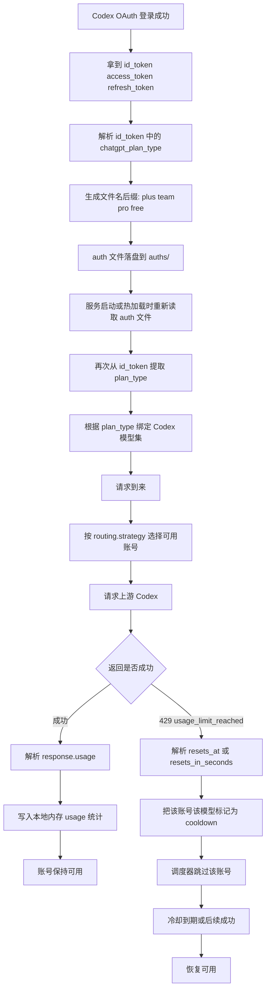
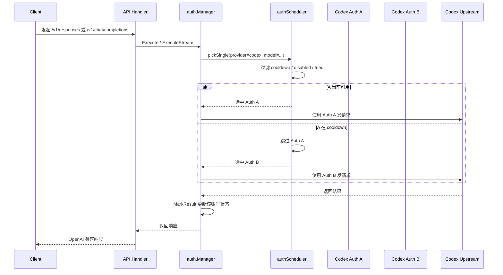

# Codex 账号档位、用量统计与冷却流程

这篇文档说明 CLIProxyAPI 在处理 Codex OAuth 账号时，实际走的是哪条链路：

1. 识别订阅档位
2. 根据档位暴露模型
3. 请求时在多个账号间选路
4. 本地记录 usage
5. 遇到 `usage_limit_reached` 后进入冷却
6. 成功后恢复可用

当前仓库里，`auths/` 下这两个 Codex 账号文件名都带 `-plus.json`，说明它们当前识别到的订阅档位是 `plus`。

## 一图看懂



## 1. 识别订阅档位

### 登录阶段

Codex 登录完成后，认证代码会解析 `id_token` 中的 OpenAI 账号信息：

- `chatgpt_plan_type`
- `chatgpt_account_id`
- 订阅起止时间

相关代码：

- `sdk/auth/codex_device.go`
- `internal/auth/codex/jwt_parser.go`

核心逻辑是：

- 先从 `id_token` 解析 JWT claims
- 读取 `claims.CodexAuthInfo.ChatgptPlanType`
- 把这个值记成运行时 `plan_type`
- 再把 `plan_type` 拼进认证文件名

因此像下面这种文件名：

```text
auths/codex-xxx@outlook.com-plus.json
```

并不表示“余额是 plus”，而是表示“这个账号识别出的订阅档位是 plus”。

### 文件里存了什么

Codex auth 文件持久化的是 token 和账户信息，不是余额：

- `id_token`
- `access_token`
- `refresh_token`
- `account_id`
- `email`
- `expired`
- `last_refresh`

没有 `balance` 或 `credit` 这类字段。

## 2. 服务重启后如何恢复档位

`plan_type` 不是直接以运行时字段写入 auth 文件再原样读回。

服务重启或热加载时，流程是：

1. `sdk/auth/filestore.go` 把 auth 文件读成 `Auth.Metadata`
2. `internal/watcher/synthesizer/file.go` 检查 provider 是否为 `codex`
3. 如果有 `id_token`，再次解析 JWT
4. 重新把 `chatgpt_plan_type` 提取成 `Auth.Attributes["plan_type"]`

所以：

- 文件名里的 `-plus`
- 运行时的 `plan_type = plus`

这两件事都来自同一份 `id_token` 信息。

## 3. 档位如何影响模型

运行时拿到 `plan_type` 之后，`sdk/cliproxy/service.go` 会选择对应的静态模型集：

- `free` -> `GetCodexFreeModels()`
- `team/business/go` -> `GetCodexTeamModels()`
- `plus` -> `GetCodexPlusModels()`
- `pro` -> `GetCodexProModels()`

也就是说，档位的直接作用不是“限制某个余额数值”，而是：

- 决定这个账号应该暴露哪些 Codex 模型
- 决定这个账号能否参与某些模型的调度

## 4. 多账号请求时怎么选

当前配置里：

```yaml
routing:
  strategy: "round-robin"
```

因此多个可用 Codex 账号的选择逻辑是轮询。

### 选路链路



### 关键点

- 只有“当前可用”的账号会进入轮询池
- 已经进入 cooldown 的账号会被跳过
- 如果所有匹配账号都在 cooldown，会返回 `model_cooldown`

所以“轮询”不是死板地 A/B/A/B，而是“在可用集合里轮询”。

## 5. 本地 usage 是怎么记的

每次请求发往 Codex 前，executor 会创建一个 `usageReporter`。

它会带上这些信息：

- provider
- model
- `authID`
- `authIndex`
- `source`
- 请求时间

其中：

- `authIndex` 是账号的稳定索引
- `source` 对 OAuth 账号通常会落成邮箱

### usage 记录时机

Codex executor 并不是在请求刚发出去就记 token，而是在看到上游响应里的 usage 后再记。

常见场景：

- SSE / stream：等到 `response.completed`
- websocket：等到 `response.completed` 或 `response.done`
- 非流式：直接读取完整响应里的 `usage`

解析字段主要来自：

```json
response.usage.input_tokens
response.usage.output_tokens
response.usage.total_tokens
response.usage.input_tokens_details.cached_tokens
response.usage.output_tokens_details.reasoning_tokens
```

### usage 最后记到哪里

usage record 会被送到全局 usage manager，再由内存 logger plugin 聚合。

管理接口：

```text
GET /v0/management/usage
```

返回的是内存快照，不会去 OpenAI 查询余额。

### 一个容易误解的点

usage 总表默认优先按“调用方 API key”聚合，不是天然按“上游 Codex 账号”聚合。

但是每条明细里会带：

- `source`
- `auth_index`

所以仍然可以看出实际命中了哪个 Codex 账号。

## 6. 遇到限额后怎么冷却

如果 Codex 上游返回：

- HTTP `429`
- `error.type = "usage_limit_reached"`

那么 executor 会尝试解析：

- `error.resets_at`
- `error.resets_in_seconds`

如果能解析到，就把这个时间作为明确的恢复时间。

如果上游没给，就走本地指数退避：

- 1s
- 2s
- 4s
- 8s
- ...
- 最大 30 分钟

### 冷却状态更新

`auth.Manager.MarkResult()` 会把这次失败写回到该账号对应模型的 `ModelState`：

- `Unavailable = true`
- `Status = error`
- `NextRetryAfter = ...`
- `Quota.Exceeded = true`
- `Quota.Reason = quota`
- `Quota.NextRecoverAt = ...`

随后它还会做两件事：

1. 把这个模型在全局 registry 里标记为 quota exceeded
2. 暂停这个账号对该模型的提供能力

### 冷却后的调度行为

调度器选账号时会检查：

- 这个模型是不是 `Unavailable`
- `NextRetryAfter` 是否还没到
- `Quota.Exceeded` 是否为 true

如果是，就把它当作 cooldown 项跳过。

## 7. 成功后如何恢复

同一个账号的同一个模型，只要后续成功一次：

- `Unavailable` 会被清掉
- `NextRetryAfter` 会被清零
- `Quota` 会被重置
- registry 里的暂停状态会恢复

也就是说，恢复不是靠手工操作，而是：

- 时间到后重新可被调度
- 或后续某次请求成功后直接恢复健康状态

## 8. 面向当前两个 Codex 账号的实际理解

结合当前仓库状态，可以把流程理解成下面这样：

1. 这两个账号登录时都从 `id_token` 识别成了 `plus`
2. 因此它们当前都被挂上了 `Codex Plus` 的模型集合
3. 请求进入时，若两者都健康，就按 `round-robin` 轮流使用
4. 每次成功请求，usage 会被写入本地内存统计
5. 如果其中一个账号对某个模型打到了 `usage_limit_reached`
6. 该账号只会在这个模型维度上进入 cooldown
7. 调度器会优先把流量切到另一个仍可用的账号
8. 冷却结束或后续成功后，该账号重新回到轮询池

## 9. 这套机制不做什么

当前这套机制不会做这些事：

- 不会主动调用 OpenAI 余额接口
- 不会得到“官方剩余余额数值”
- 不会得到“本月还剩多少钱”
- 不会根据余额做精细分流

它做的是：

- 识别账号所属订阅档位
- 使用本地 usage 统计做观测
- 使用上游返回的 quota/429 信号做冷却和切换

## 10. 关键代码入口

如果你想顺着代码继续看，优先看这些文件：

- `sdk/auth/codex_device.go`
- `internal/auth/codex/jwt_parser.go`
- `internal/auth/codex/filename.go`
- `internal/watcher/synthesizer/file.go`
- `sdk/cliproxy/service.go`
- `sdk/cliproxy/auth/conductor.go`
- `sdk/cliproxy/auth/scheduler.go`
- `internal/runtime/executor/codex_executor.go`
- `internal/runtime/executor/codex_websockets_executor.go`
- `internal/runtime/executor/usage_helpers.go`
- `internal/usage/logger_plugin.go`
- `internal/api/handlers/management/usage.go`
