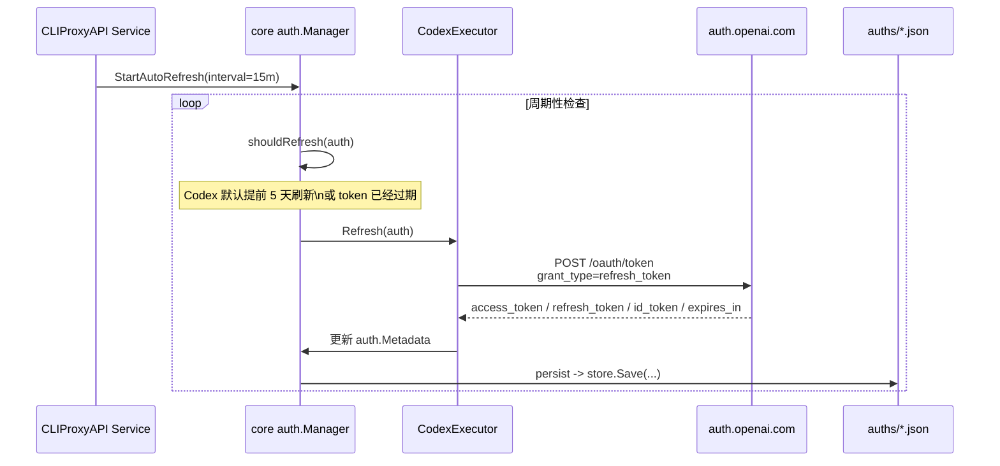

# CLIProxyAPI + Codex 使用总结

## 当前结论

- 项目已经可以在本机正常运行
- 本机 Go 已切换到 `1.26.1`
- 已成功登录 1 个 Codex OAuth 账号
- 认证文件已落盘到 `auths/`
- `access_token` 到期后会自动续期，并回写到原来的 `auths/*.json`
- `/v1/models` 已能列出 Codex 模型
- `/v1/responses` 调用已成功走通

## 本机运行方式

### 编译

```bash
cd /Users/link/workspace/CLIProxyAPI
make build
```

产物会生成到：

```text
./CLIProxyAPI
```

### 运行

```bash
./CLIProxyAPI -config ./config.yaml
```

如果只想用本地内置模型目录、跳过远程模型拉取：

```bash
./CLIProxyAPI -config ./config.yaml -local-model
```

## 当前配置说明

当前配置文件：

```text
./config.yaml
```

关键配置：

- `host: 127.0.0.1`
- `port: 8317`
- `auth-dir: ./auths`
- `remote-management.secret-key` 已设置
- `usage-statistics-enabled: true`

## 管理后台

### 访问地址

后台页面不是根路径 `/`，而是：

```text
http://127.0.0.1:8317/management.html
```

### 管理接口

管理 API 挂在：

```text
/v0/management
```

例如：

```text
GET /v0/management/config
GET /v0/management/usage
```

### Usage 页面没有数据的原因

之前 `usage-statistics-enabled` 是 `false`，所以调用虽然成功，但后台 `#/usage` 页面不会累计统计。

后来已改成：

```yaml
usage-statistics-enabled: true
```

注意：

- 只会统计开启之后的新请求
- 旧请求一般不会补录

## Codex OAuth 登录是怎么实现的

### 登录入口

命令：

```bash
./CLIProxyAPI -config ./config.yaml -codex-login
```

入口代码：

```text
internal/cmd/openai_login.go
sdk/auth/codex.go
```

### 核心流程

1. 生成 PKCE 参数和随机 `state`
2. 本地启动一个 OAuth 回调服务
3. 打开浏览器跳到 OpenAI OAuth 授权页
4. OpenAI 登录完成后重定向回本地回调地址
5. 本地服务拿到 `code`
6. 用 `code + code_verifier` 向 OpenAI token 接口换 token
7. 解析 `id_token`
8. 生成认证文件并保存到 `auth-dir`

### 本地回调地址

默认回调地址：

```text
http://localhost:1455/auth/callback
```

### OpenAI OAuth 接口

- 授权地址：`https://auth.openai.com/oauth/authorize`
- Token 地址：`https://auth.openai.com/oauth/token`

## 认证文件

当前认证文件：

```text
./auths/codex-timothythomas3677@outlook.com-plus.json
```

### 文件包含的核心字段

- `type`: provider 类型，这里是 `codex`
- `email`: 登录账号邮箱
- `account_id`: OpenAI 账号 ID
- `access_token`: 实际请求上游 Codex 时使用的 Bearer Token
- `refresh_token`: 用于自动刷新 access token
- `id_token`: 身份信息 JWT
- `last_refresh`: 最近一次刷新时间
- `expired`: 当前 access token 过期时间
- `disabled`: 是否禁用该认证文件

### 最关键的字段

`access_token` 是最关键的鉴权凭证，因为真正发请求到上游时，代理会加上：

```http
Authorization: Bearer <access_token>
```

但它不是唯一关键项，因为请求不仅仅是“换 Bearer 后转发”。

## access_token 到期后怎么续期

### 先说结论

- Codex 的 `access_token` 续期主要依赖后台自动刷新，不是重新走登录流程
- 真正拿去换新 token 的是 `refresh_token`
- 续期成功后，会把新 token 自动写回 `auths/` 目录里的原认证文件
- 只要 `refresh_token` 仍然有效，通常不需要重新执行 `-codex-login`

### 一图看懂



### 刷新是怎么被触发的

服务启动后，`coreManager` 会启动后台自动刷新任务：

- 默认检查周期：`15 分钟`
- 检查对象：所有 OAuth 类型的 auth
- Codex 默认刷新提前量：`5 天`

也就是说，Codex 不是等 `access_token` 彻底失效才处理，而是倾向于提前续期。

### 真正的刷新请求

后台决定要刷新后，会走 Codex executor 的 `Refresh()` 逻辑：

1. 从 `auth.Metadata["refresh_token"]` 取出 `refresh_token`
2. 向 OpenAI token 接口发请求
3. 使用 `grant_type=refresh_token` 换取新的 token
4. 解析新的 `access_token`、`refresh_token`、`id_token` 和 `expires_in`
5. 把过期时间重新计算成新的 `expired`

请求目标仍然是：

- `https://auth.openai.com/oauth/token`

而不是重新打开浏览器走一遍 OAuth 登录。

### 刷新成功后会更新哪些字段

续期成功后，会更新 auth 元数据中的这些核心字段：

- `access_token`
- `refresh_token`，如果上游返回了新的值
- `id_token`
- `account_id`
- `email`
- `expired`
- `last_refresh`

之后新的上游请求就会自动使用新的 `access_token` 作为 Bearer Token。

### 会不会自动更新 `auths/` 目录里的文件

会。

刷新成功后，manager 会调用持久化逻辑，把更新后的 metadata 再写回 auth store。默认文件存储模式下，这会直接覆盖原来的 `auths/*.json` 文件，而不是只改内存不落盘。

因此看到的行为应该是：

- 首次登录后生成一个 `auths/codex-xxx.json`
- 后续自动刷新时，还是更新这同一个文件
- 不需要你手工再导出或复制新的 token 文件

### 还需不需要重新登录

通常不需要，只要下面几件事同时成立：

- `auths/` 里的 Codex 文件还在
- 文件里还有可用的 `refresh_token`
- 后台自动刷新能成功
- OpenAI 侧没有撤销这次授权

更准确地说，是否要重新登录，取决于这份 OAuth 授权还能不能继续用 `refresh_token` 换新 `access_token`，不只取决于“订阅还在不在”。

### 哪些情况下才需要重新登录

常见情况包括：

- `refresh_token` 已失效
- 授权被撤销
- `refresh_token` 被复用或被上游判定不可再用
- `auths/*.json` 被删除、损坏，或者关键字段丢失
- 自动刷新长期失败，无法恢复

### 一个实现细节

当前实现更偏向“后台预刷新”，不是“某次请求碰到 `401` 后立刻同步刷新并重放同一请求”。

这意味着：

- 正常情况下，token 会在到期前被自动续上
- 如果后台刷新没来得及跑到，个别请求仍可能先失败一次

但设计意图很明确：优先依赖 `refresh_token` 自动续期，而不是让用户反复登录

## CLIProxyAPI 是怎么代理 Codex 请求的

### 请求入口

常见入口：

- `POST /v1/chat/completions`
- `POST /v1/responses`
- `GET /v1/models`

如果目标模型属于 Codex provider，就会路由到 Codex executor。

### 真正的上游地址

默认上游地址：

```text
https://chatgpt.com/backend-api/codex/responses
```

如果是 compact：

```text
https://chatgpt.com/backend-api/codex/responses/compact
```

如果是 websocket，上游会转成：

```text
wss://chatgpt.com/backend-api/codex/responses
```

### 它不只是“换 URL + Bearer”

除了改 URL 和 `Authorization`，CLIProxyAPI 还会：

- 重写请求 body
- 增加 Codex 相关请求头
- 补充 session / cache 字段
- 删除 Codex 不支持的字段
- 将响应再翻译回 OpenAI 兼容格式

### 典型请求头

代理会补的关键请求头包括：

- `Authorization: Bearer <access_token>`
- `Content-Type: application/json`
- `Accept: text/event-stream` 或 `application/json`
- `User-Agent: codex_cli_rs/...`
- `Originator: codex_cli_rs`
- `Chatgpt-Account-Id: <account_id>`
- `Session_id: <uuid>`

### Body 也会被改写

例如下游发 OpenAI Responses 风格请求时，代理会把它转换成 Codex 接受的结构，并处理这些兼容逻辑：

- 强制 `stream: true`
- 设置 `store: false`
- 设置 `parallel_tool_calls: true`
- 增加 `include: ["reasoning.encrypted_content"]`
- 删除不兼容字段：
  - `temperature`
  - `top_p`
  - `max_output_tokens`
  - `max_completion_tokens`
  - `user`
  - `context_management`
- 将 `system` role 改成 `developer`

## 当前验证结果

### 模型列表

`/v1/models` 已返回 Codex 模型，例如：

- `gpt-5.4`
- `gpt-5.4-mini`
- `gpt-5.3-codex`
- `gpt-5.2-codex`

### 实际调用日志

从日志上已经确认：

- 代理选中了 Codex OAuth 认证文件
- 模型 `gpt-5.4` 已成功调用
- `/v1/responses` 返回 `200`
- thinking 参数也已生效

示例日志含义：

- `Use OAuth provider=codex ... for model gpt-5.4`
- `thinking ... level=high`
- `POST "/v1/responses"`
- `200`

这说明整条链路已经打通：

```text
客户端 -> CLIProxyAPI -> Codex OAuth -> chatgpt.com/backend-api/codex/responses -> 返回结果
```

## 最接近 Codex 的下游调用方式

如果想模拟 Codex 客户端请求，优先使用：

```text
POST /v1/responses
```

而不是优先用：

```text
POST /v1/chat/completions
```

因为 `/v1/responses` 更接近 Codex 的原生调用模式。

## 推荐的后续动作

### 继续验证 HTTP 请求

```bash
curl http://127.0.0.1:8317/v1/responses \
  -H "Authorization: Bearer <YOUR_API_KEY>" \
  -H "Content-Type: application/json" \
  -d '{
    "model": "gpt-5.4-mini",
    "instructions": "You are Codex.",
    "input": [
      {
        "role": "user",
        "content": [
          { "type": "input_text", "text": "hello" }
        ]
      }
    ],
    "stream": false
  }'
```

### 查看 Usage 统计

重启服务后，再发新请求，然后访问：

```text
http://127.0.0.1:8317/management.html#/usage
```

## 关键文件索引

- [cmd/server/main.go](/Users/link/workspace/CLIProxyAPI/cmd/server/main.go)
- [config.yaml](/Users/link/workspace/CLIProxyAPI/config.yaml)
- [Makefile](/Users/link/workspace/CLIProxyAPI/Makefile)
- [sdk/cliproxy/service.go](/Users/link/workspace/CLIProxyAPI/sdk/cliproxy/service.go)
- [sdk/cliproxy/auth/conductor.go](/Users/link/workspace/CLIProxyAPI/sdk/cliproxy/auth/conductor.go)
- [sdk/cliproxy/auth/types.go](/Users/link/workspace/CLIProxyAPI/sdk/cliproxy/auth/types.go)
- [sdk/auth/codex.go](/Users/link/workspace/CLIProxyAPI/sdk/auth/codex.go)
- [sdk/auth/codex_device.go](/Users/link/workspace/CLIProxyAPI/sdk/auth/codex_device.go)
- [sdk/auth/manager.go](/Users/link/workspace/CLIProxyAPI/sdk/auth/manager.go)
- [sdk/auth/filestore.go](/Users/link/workspace/CLIProxyAPI/sdk/auth/filestore.go)
- [internal/auth/codex/openai_auth.go](/Users/link/workspace/CLIProxyAPI/internal/auth/codex/openai_auth.go)
- [internal/auth/codex/oauth_server.go](/Users/link/workspace/CLIProxyAPI/internal/auth/codex/oauth_server.go)
- [internal/auth/codex/token.go](/Users/link/workspace/CLIProxyAPI/internal/auth/codex/token.go)
- [internal/runtime/executor/codex_executor.go](/Users/link/workspace/CLIProxyAPI/internal/runtime/executor/codex_executor.go)
- [internal/runtime/executor/codex_websockets_executor.go](/Users/link/workspace/CLIProxyAPI/internal/runtime/executor/codex_websockets_executor.go)
- [sdk/api/handlers/openai/openai_responses_handlers.go](/Users/link/workspace/CLIProxyAPI/sdk/api/handlers/openai/openai_responses_handlers.go)
- [sdk/api/handlers/openai/openai_responses_websocket.go](/Users/link/workspace/CLIProxyAPI/sdk/api/handlers/openai/openai_responses_websocket.go)
