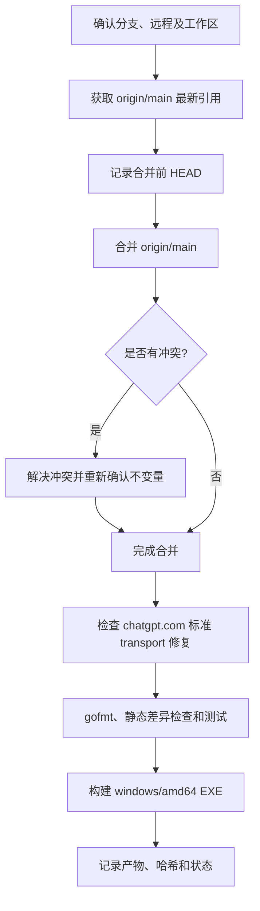

# 合并 `origin/main` 并构建 Windows EXE 操作手册

## 目标

将最新的 `origin/main` 合并到当前功能分支，同时必须保留当前分支对 `chatgpt.com` 的修复：该域名必须使用标准 HTTP transport，不能回到 uTLS transport。完成合并后，在 Windows 11 上构建可执行文件 `cli-proxy-api.exe`。

本文档仅覆盖本地合并、验证和构建；**不会推送分支或修改远程仓库**。

## 必须保持的功能不变量

文件 `internal/runtime/executor/helps/utls_client.go` 中：

- `utlsProtectedHosts` 仅应包含需要 Chrome TLS 指纹的域名（当前为 `api.anthropic.com`）。
- `chatgpt.com` **不得**出现在 `utlsProtectedHosts` 中。
- 因此访问 `https://chatgpt.com/...` 会经由 `fallbackRoundTripper.fallback`，即标准 HTTP transport；这保留了 chatgpt.com 的 HTTP/1 fallback 修复。

不要用“重新把 `chatgpt.com` 加入 uTLS 域名表”的方式解决连接问题；那会回退本任务要求保留的修复。

## 流程总览



## 前置条件和安全边界

1. 在仓库根目录执行所有命令，例如：`C:\company\code\CLIProxyAPI`。
2. 使用 PowerShell；以下命令不依赖 WSL。
3. 当前分支应为需要保留 chatgpt.com 修复的功能分支，例如 `fix/chatgpt-http1-fallback`。
4. 合并前不应有**已跟踪文件**的未提交修改。未跟踪文件可以保留，但如果远程合并会写入同名路径，Git 会拒绝合并，应先由文件所有者处理。
5. 不使用 `git reset --hard`、`git checkout --` 等会丢弃用户改动的命令。
6. `git merge --abort` 仅可在仍处于合并冲突状态、且确认不需要保留本次手工冲突解决内容时使用。

## 1. 合并前检查并更新远程引用

```powershell
Set-Location C:\company\code\CLIProxyAPI

git status --short --branch
git branch --show-current
git remote -v

# 若输出含有 M、A、D、R 等已跟踪文件改动，先停止并处理；不要直接覆盖。
git diff --name-only
git diff --cached --name-only

# 获取 origin/main 的最新状态，并删除已在远程不存在的引用。
git fetch origin --prune

git log --oneline --decorate -n 5 origin/main
git rev-list --left-right --count HEAD...origin/main
```

`git rev-list` 的结果格式为“当前分支独有提交数、origin/main 独有提交数”。仅当确认第二个数字是预期范围内的更新时再继续。

若当前分支仍应跟踪自己的 fork 分支，也可以额外确认该关系；这不影响从 `origin/main` 合并：

```powershell
git status --short --branch
git rev-list --left-right --count HEAD...fork/fix/chatgpt-http1-fallback
```

## 2. 执行合并

在同一个 PowerShell 会话中记录合并前提交，并执行非交互式合并：

```powershell
$headBeforeMerge = git rev-parse HEAD
git merge --no-edit origin/main
if ($LASTEXITCODE -ne 0) {
    throw 'origin/main 合并未完成；请按“合并冲突处理”章节操作。'
}

git log -1 --format='%H%n%s%n%ci'
git status --short --branch
```

合并成功后通常会产生 merge commit；如果 Git 能快进，则不会有 merge commit，这也是正常结果。

### 合并冲突处理

若 `git merge` 报冲突：

```powershell
git status
git diff --name-only --diff-filter=U
```

逐个解决冲突后，必须优先确认 `internal/runtime/executor/helps/utls_client.go` 满足本文档的“功能不变量”。然后执行：

```powershell
git add <已解决的文件路径>
git merge --continue
git diff --check
```

如果决定放弃**尚未完成的本次合并**，并且不需要保留已做的手工冲突解决内容：

```powershell
git merge --abort
```

不要通过重置分支来绕过冲突。

## 3. 验证 chatgpt.com 的标准 transport / HTTP/1 fallback 修复

先进行源码级保护检查。以下命令若找到 `"chatgpt.com":` 形式的 map 项会直接失败：

```powershell
$utlsClientFile = 'internal/runtime/executor/helps/utls_client.go'

Get-Content $utlsClientFile | Select-String -Pattern 'utlsProtectedHosts|chatgpt\.com|api\.anthropic\.com' -Context 2,2

if (Select-String -Path $utlsClientFile -Pattern '^\s*"chatgpt\.com"\s*:') {
    throw 'chatgpt.com 被重新加入 utlsProtectedHosts；不能继续构建。'
}
```

再执行覆盖路由选择的测试：

```powershell
go test -count=1 -run '^TestFallbackRoundTripperRoutesHosts$' ./internal/runtime/executor/helps
if ($LASTEXITCODE -ne 0) {
    throw 'chatgpt.com 标准 transport 回归测试失败。'
}
```

该测试应验证：

- `chatgpt.com` 走 fallback transport；
- `api.anthropic.com` 走 uTLS transport；
- 域名匹配大小写不敏感。

## 4. 格式化并检查合并差异

以下命令仅格式化本次从远程合入（以及处理冲突产生）的 Go 文件。`$headBeforeMerge` 在第 2 节定义，必须在同一个 PowerShell 会话中保留。

```powershell
$goFiles = git diff --name-only "$headBeforeMerge..HEAD" -- '*.go'
foreach ($goFile in $goFiles) {
    gofmt -w $goFile
}

git diff --check
if ($LASTEXITCODE -ne 0) {
    throw '发现空白字符错误；请修正后再继续。'
}
```

若因重开 PowerShell 窗口而丢失 `$headBeforeMerge`，可改为手工指定合并前提交，或在 merge commit 存在时使用：

```powershell
$goFiles = git diff --name-only HEAD^1..HEAD -- '*.go'
foreach ($goFile in $goFiles) {
    gofmt -w $goFile
}
```

## 5. 测试策略

先执行与本次合并影响最大的包：

```powershell
go test ./internal/runtime/executor/helps
go test ./internal/api
go test ./sdk/api/handlers/openai
go test ./internal/translator/openai/openai/responses
```

在时间允许时，再执行完整测试：

```powershell
go test ./...
```

任一命令失败时，先记录完整失败输出，再判断是否是本次合并引入：

1. 使用 `git log --oneline -- <失败文件>` 确认相关代码最近来源；
2. 运行失败测试的最小命令，例如 `go test -count=1 -run '^TestName$' ./package/path`；
3. 不为了让测试“变绿”而直接降低断言或删除测试；
4. 如果不影响 EXE 编译，仍可构建产物，但交付时必须明确记录失败测试、实际值和预期值。

### 本次记录的测试基线说明

在合并提交 `ac7ffafa` 上，以下单测可独立复现失败：

```powershell
go test -count=1 -run '^TestModelsWithClientVersionReturnsCodexCatalog$' ./internal/api
```

失败信息是 `custom priority = 143, want 129`（`internal/api/server_test.go:923`）。它与 chatgpt.com transport 修复无关，且不会阻止 `go build`。未来再次执行时应重新判断该断言是否已被上游更新，不应把本节视为永久豁免。

## 6. 构建 Windows 11 可执行文件

先确认目标平台是 Windows x64。不要删除现有 EXE；若文件正在运行，`go build` 会给出文件占用错误，应先停止实际运行中的服务后重试。

```powershell
$goos = go env GOOS
$goarch = go env GOARCH
if ($goos -ne 'windows' -or $goarch -ne 'amd64') {
    throw "当前 Go 目标是 $goos/$goarch，预期为 windows/amd64。"
}

go build -o .\cli-proxy-api.exe ./cmd/server
if ($LASTEXITCODE -ne 0) {
    throw 'Windows EXE 构建失败。'
}

Get-Item .\cli-proxy-api.exe | Select-Object FullName, Length, LastWriteTime
Get-FileHash .\cli-proxy-api.exe -Algorithm SHA256
```

预期产物：仓库根目录的 `cli-proxy-api.exe`。它是面向 Windows 11 x64 的 `windows/amd64` 二进制。

## 7. 交付前最终检查

```powershell
git status --short --branch
git log --oneline --decorate -n 5
git diff --check
```

应在交付说明中记录：

- 合并后的 HEAD 提交哈希；
- 合入的 `origin/main` 提交哈希；
- chatgpt.com 标准 transport 测试是否通过；
- 执行过的测试及失败项（如有）；
- EXE 的绝对路径、大小和 SHA-256；
- 用户原有的未跟踪文件或未提交改动是否保持未动。

如果需要把合并结果发布到 fork，请在用户明确授权后单独执行 `git push`；本流程默认不推送。
