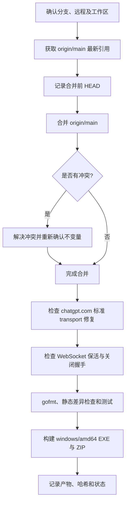

# 合并 `origin/main`、验证 Codex WebSocket 并构建 Windows 产物操作手册

## 目标

将最新的 `origin/main` 合并到当前功能分支，同时必须保留以下两类修复：

- `chatgpt.com` 必须使用标准 HTTP transport，不能回到 uTLS transport；
- Codex Responses WebSocket 必须具备上下游心跳、空闲上游重建以及标准关闭握手，避免长时间空闲后反复出现 `Connection reset without closing handshake`。

完成合并和验证后，在 Windows 11 上构建 `windows/amd64` 的 EXE 与 ZIP 发布包。

本文档仅覆盖本地合并、验证和构建；**不会推送分支或修改远程仓库**。

## 必须保持的功能不变量

文件 `internal/runtime/executor/helps/utls_client.go` 中：

- `utlsProtectedHosts` 仅应包含需要 Chrome TLS 指纹的域名（当前为 `api.anthropic.com`）。
- `chatgpt.com` **不得**出现在 `utlsProtectedHosts` 中。
- 因此访问 `https://chatgpt.com/...` 会经由 `fallbackRoundTripper.fallback`，即标准 HTTP transport；这保留了 chatgpt.com 的 HTTP/1 fallback 修复。

不要用“重新把 `chatgpt.com` 加入 uTLS 域名表”的方式解决连接问题；那会回退本任务要求保留的修复。

## 必须保持的 Codex WebSocket 行为

涉及文件：

- `internal/runtime/executor/codex_websockets_executor.go`
- `sdk/api/handlers/openai/openai_responses_websocket.go`

合并或修改时必须保持以下行为：

- CLIProxyAPI 到 Codex 上游的连接每 1 分钟发送一次 Ping；收到 Ping 或 Pong 后刷新 5 分钟的 WebSocket 活性读期限。
- Codex CLI 到 CLIProxyAPI 的下游连接每 30 秒发送一次 Ping，防止 Nginx、Cloudflare 等中间层因空闲回收连接。
- 上游连接在没有活跃生成请求时断开，只淘汰该上游连接，不关闭下游会话；下一次请求通过现有连接建立逻辑自动重连。
- 上游连接在活跃生成请求期间断开，向下游发送关闭代码 `1011` 和原因 `upstream websocket disconnected`。
- 关闭下游连接前必须先发送 WebSocket Close 控制帧，并确保多条退出路径只关闭一次，避免客户端报告 `without closing handshake`。
- 上游业务消息和心跳控制帧的写操作必须保持并发安全。

Codex WebSocket 的活性读期限是本项目网络超时规则中明确允许的例外，不要在其他已建立连接的网络路径上扩散新的超时。

## 流程总览



## 前置条件和安全边界

1. 在仓库根目录执行所有命令，例如：`C:\company\code\CLIProxyAPI`。
2. 使用 PowerShell；以下命令不依赖 WSL。
3. 当前分支应为需要保留 chatgpt.com 修复的功能分支，例如 `fix/chatgpt-http1-fallback`。
4. 合并前不应有**已跟踪文件**的未提交修改。未跟踪文件可以保留，但如果远程合并会写入同名路径，Git 会拒绝合并，应先由文件所有者处理。
5. 不使用 `git reset --hard`、`git checkout --` 等会丢弃用户改动的命令。
6. `git merge --abort` 仅可在仍处于合并冲突状态、且确认不需要保留本次手工冲突解决内容时使用。

## 1. 合并前检查并更新远程引用

```powershell
Set-Location C:\company\code\CLIProxyAPI

git status --short --branch
git branch --show-current
git remote -v

# 若输出含有 M、A、D、R 等已跟踪文件改动，先停止并处理；不要直接覆盖。
git diff --name-only
git diff --cached --name-only

# 获取 origin/main 的最新状态，并删除已在远程不存在的引用。
git fetch origin --prune

git log --oneline --decorate -n 5 origin/main
git rev-list --left-right --count HEAD...origin/main
```

`git rev-list` 的结果格式为“当前分支独有提交数、origin/main 独有提交数”。仅当确认第二个数字是预期范围内的更新时再继续。

若当前分支仍应跟踪自己的 fork 分支，也可以额外确认该关系；这不影响从 `origin/main` 合并：

```powershell
git status --short --branch
git rev-list --left-right --count HEAD...fork/fix/chatgpt-http1-fallback
```

## 2. 执行合并

在同一个 PowerShell 会话中记录合并前提交，并执行非交互式合并：

```powershell
$headBeforeMerge = git rev-parse HEAD
git merge --no-edit origin/main
if ($LASTEXITCODE -ne 0) {
    throw 'origin/main 合并未完成；请按“合并冲突处理”章节操作。'
}

git log -1 --format='%H%n%s%n%ci'
git status --short --branch
```

合并成功后通常会产生 merge commit；如果 Git 能快进，则不会有 merge commit，这也是正常结果。

### 合并冲突处理

若 `git merge` 报冲突：

```powershell
git status
git diff --name-only --diff-filter=U
```

逐个解决冲突后，必须优先确认 `internal/runtime/executor/helps/utls_client.go` 满足本文档的“功能不变量”。然后执行：

```powershell
git add <已解决的文件路径>
git merge --continue
git diff --check
```

如果决定放弃**尚未完成的本次合并**，并且不需要保留已做的手工冲突解决内容：

```powershell
git merge --abort
```

不要通过重置分支来绕过冲突。

## 3. 验证 chatgpt.com 的标准 transport / HTTP/1 fallback 修复

先进行源码级保护检查。以下命令若找到 `"chatgpt.com":` 形式的 map 项会直接失败：

```powershell
$utlsClientFile = 'internal/runtime/executor/helps/utls_client.go'

Get-Content $utlsClientFile | Select-String -Pattern 'utlsProtectedHosts|chatgpt\.com|api\.anthropic\.com' -Context 2,2

if (Select-String -Path $utlsClientFile -Pattern '^\s*"chatgpt\.com"\s*:') {
    throw 'chatgpt.com 被重新加入 utlsProtectedHosts；不能继续构建。'
}
```

再执行覆盖路由选择的测试：

```powershell
go test -count=1 -run '^TestFallbackRoundTripperRoutesHosts$' ./internal/runtime/executor/helps
if ($LASTEXITCODE -ne 0) {
    throw 'chatgpt.com 标准 transport 回归测试失败。'
}
```

该测试应验证：

- `chatgpt.com` 走 fallback transport；
- `api.anthropic.com` 走 uTLS transport；
- 域名匹配大小写不敏感。

## 4. 验证 Codex WebSocket 保活与关闭握手

先检查关键实现仍然存在：

```powershell
$upstreamFile = 'internal/runtime/executor/codex_websockets_executor.go'
$downstreamFile = 'sdk/api/handlers/openai/openai_responses_websocket.go'

Get-Content $upstreamFile | Select-String -Pattern 'HeartbeatInterval|SetPingHandler|SetPongHandler|upstreamHeartbeatLoop|invalidateUpstreamConnWithNotify'
Get-Content $downstreamFile | Select-String -Pattern 'HeartbeatInterval|responsesWebsocketCloser|runResponsesWebsocketHeartbeat|CloseInternalServerErr'
```

然后执行回归测试：

```powershell
go test -count=1 -run '^(TestCodexWebsocketsUpstreamDisconnectChanSignalsOnInvalidate|TestCodexWebsocketsIdleUpstreamDisconnectDoesNotCloseDownstreamSession|TestCodexWebsocketsHeartbeatSendsPing)$' ./internal/runtime/executor
if ($LASTEXITCODE -ne 0) {
    throw 'Codex 上游 WebSocket 保活或断线处理测试失败。'
}

go test -count=1 -run '^(TestResponsesWebsocketClosesOnCodexUpstreamDisconnect|TestResponsesWebsocketHeartbeatSendsPing)$' ./sdk/api/handlers/openai
if ($LASTEXITCODE -ne 0) {
    throw 'Codex 下游 WebSocket 心跳或关闭握手测试失败。'
}
```

这些测试分别验证：

- 空闲上游断开不会误关下游会话；
- 上下游心跳会发送 Ping；
- 活跃请求的上游故障会通过标准关闭握手向下游返回 `1011`，而不是直接重置 TCP 连接。

## 5. 格式化并检查合并差异

以下命令仅格式化本次从远程合入（以及处理冲突产生）的 Go 文件。`$headBeforeMerge` 在第 2 节定义，必须在同一个 PowerShell 会话中保留。

```powershell
$goFiles = git diff --name-only "$headBeforeMerge..HEAD" -- '*.go'
foreach ($goFile in $goFiles) {
    gofmt -w $goFile
}

git diff --check
if ($LASTEXITCODE -ne 0) {
    throw '发现空白字符错误；请修正后再继续。'
}
```

若因重开 PowerShell 窗口而丢失 `$headBeforeMerge`，可改为手工指定合并前提交，或在 merge commit 存在时使用：

```powershell
$goFiles = git diff --name-only HEAD^1..HEAD -- '*.go'
foreach ($goFile in $goFiles) {
    gofmt -w $goFile
}
```

## 6. 测试策略

先执行与本次合并影响最大的包：

```powershell
go test ./internal/runtime/executor/helps
go test ./internal/runtime/executor
go test ./internal/api
go test ./sdk/api/handlers/openai
go test ./internal/translator/openai/openai/responses
```

在时间允许时，再执行完整测试：

```powershell
go test ./...
```

任一命令失败时，先记录完整失败输出，再判断是否是本次合并引入：

1. 使用 `git log --oneline -- <失败文件>` 确认相关代码最近来源；
2. 运行失败测试的最小命令，例如 `go test -count=1 -run '^TestName$' ./package/path`；
3. 不为了让测试“变绿”而直接降低断言或删除测试；
4. 如果不影响 EXE 编译，仍可构建产物，但交付时必须明确记录失败测试、实际值和预期值。

### 2026-07-17 合并与修复验证记录

本次合并状态：

- 合入的 `origin/main`：`f583414fd9914f9ccfd280fc3a23aebaea30e9eb`（`v7.2.82`）；
- 合并提交：`c0661e912a7b10cf3f15588b8169b2aa4675d819`；
- `go test -count=1 ./...`：通过；
- WebSocket 新增测试分别连续执行 10 次：通过；
- `go build -o test-output-websocket.exe ./cmd/server`：通过；
- `git diff --check`：通过。

`go test -race` 未执行成功，原因是当时环境为 `CGO_ENABLED=0` 且系统没有可用的 GCC/Clang；这是测试环境限制，不是普通测试或编译失败。后续环境具备 C 编译器时，仍建议补跑竞态检测。

2026-07-18 提交前再次验证时，两组 WebSocket 回归测试各连续执行 10 次均通过，服务端独立编译也通过。`go test -count=1 ./...` 中除 `cmd/fetch_codex_models` 外的包全部通过；该工具包的临时测试 EXE 在 Windows Defender 实时保护启用的环境中连续两次被系统拒绝执行，错误为 `Access is denied` / `0xc0000022`，没有发生 Go 测试断言失败。不要为了绕过该环境限制而关闭系统安全防护；需要补验时，应在允许执行 Go 临时测试二进制的受控环境中单独运行：

```powershell
go test -count=1 -v ./cmd/fetch_codex_models
```

## 7. 构建 Windows 11 发布产物

推荐使用仓库根目录的 `build-release-windows-amd64.ps1`。它会构建带版本信息的独立 EXE，并生成包含 EXE、示例配置、许可证和中英文说明的 ZIP。

合并、修改和测试均已提交，且当前分支允许从其跟踪远程拉取时，执行：

```powershell
& .\build-release-windows-amd64.ps1
```

如果已经按本文档手工获取并合并了 `origin/main`，为避免脚本再次执行 `git pull`，使用：

```powershell
& .\build-release-windows-amd64.ps1 `
    -SkipPull `
    -SkipDependencyDownload
```

仅在明确需要对未提交代码生成试用包时增加 `-AllowDirty`。此时版本名会包含 `-dirty`，交付说明必须明确指出该产物不是从干净工作区构建：

```powershell
& .\build-release-windows-amd64.ps1 `
    -SkipPull `
    -AllowDirty `
    -SkipDependencyDownload
```

脚本默认使用 `GOPROXY=https://goproxy.cn,direct` 和 `GOSUMDB=sum.golang.google.cn`；如需使用其他镜像，可通过参数覆盖。不要把代理凭据或其他密钥写入脚本或提交到仓库。

若只需要执行项目要求的编译校验，可单独构建临时 EXE。先确认目标平台是 Windows x64：

```powershell
$goos = go env GOOS
$goarch = go env GOARCH
if ($goos -ne 'windows' -or $goarch -ne 'amd64') {
    throw "当前 Go 目标是 $goos/$goarch，预期为 windows/amd64。"
}

go build -o .\test-output.exe ./cmd/server
if ($LASTEXITCODE -ne 0) {
    throw 'Windows EXE 构建失败。'
}

Get-Item .\test-output.exe | Select-Object FullName, Length, LastWriteTime
Get-FileHash .\test-output.exe -Algorithm SHA256
Remove-Item -LiteralPath .\test-output.exe
```

发布脚本的预期产物位于 `dist`：

- `dist\CLIProxyAPI_<version>_windows_amd64.zip`：推荐交付包；
- `dist\cli-proxy-api_<version>_<commit>_<timestamp>_windows_amd64.exe`：带版本和时间戳的独立 EXE；
- `dist\windows-amd64\archive\`：最近一次成功同步的解压目录。

如果旧 EXE 正在运行，Windows 可能锁定文件，导致 `archive` 目录无法更新。脚本仍会优先保留新 ZIP 和带时间戳的独立 EXE；停止现有服务后，再从新 ZIP 解压替换。不要直接覆盖正在运行的进程文件。

### 2026-07-17 WebSocket 修复试用包

本次未提交状态下生成的试用包如下，版本包含 `-dirty` 属预期行为：

- ZIP：`dist\CLIProxyAPI_7.2.82-5-gc0661e91-dirty_windows_amd64.zip`
  - 大小：`15,625,889` 字节
  - SHA-256：`4A59614715DED93193274F6631FB07ED91D276ED46E9FB4707D141BF924CF589`
- EXE：`dist\cli-proxy-api_7.2.82-5-gc0661e91-dirty_c0661e91_20260717171712_windows_amd64.exe`
  - 大小：`47,944,704` 字节
  - SHA-256：`26F3CC08AFF58CA68C7B5193E4EB369946D4C0F61DC14EEA5AE8081C08B91370`

`dist\cli-proxy-api-7.2.65-http1fix.exe` 是此前保留的历史 HTTP/1 修复产物，不包含本节记录的最新 WebSocket 保活修复，不应作为本次试用的首选文件。

嵌入的构建信息为：

```text
CLIProxyAPI Version: 7.2.82-5-gc0661e91-dirty
Commit: c0661e91
BuiltAt: 2026-07-17T09:17:12Z
```

替换步骤：

1. 备份当前使用的 EXE 和配置文件；
2. 停止正在运行的 `cli-proxy-api` 服务或进程；
3. 校验下载/复制后文件的 SHA-256；
4. 用 ZIP 中的 `cli-proxy-api.exe` 或上述独立 EXE 替换旧程序；
5. 继续使用原来的 `config.yaml` 和 `auths` 目录启动服务；
6. 建立 Codex WebSocket 会话，空闲超过原先容易断开的时间后再发送请求，确认不再持续出现 `Reconnecting...` 和 `without closing handshake`。

如需回滚，停止服务并恢复第 1 步备份的 EXE；配置格式未因本次 WebSocket 修复发生变化。

## 8. 交付前最终检查

```powershell
git status --short --branch
git log --oneline --decorate -n 5
git diff --check
```

应在交付说明中记录：

- 合并后的 HEAD 提交哈希；
- 合入的 `origin/main` 提交哈希；
- chatgpt.com 标准 transport 测试是否通过；
- Codex WebSocket 心跳、空闲重连和关闭握手测试是否通过；
- 执行过的测试及失败项（如有）；
- EXE 与 ZIP 的绝对路径、大小和 SHA-256；
- 用户原有的未跟踪文件或未提交改动是否保持未动。

如果需要把合并结果发布到 fork，请在用户明确授权后单独执行 `git push`；本流程默认不推送。
